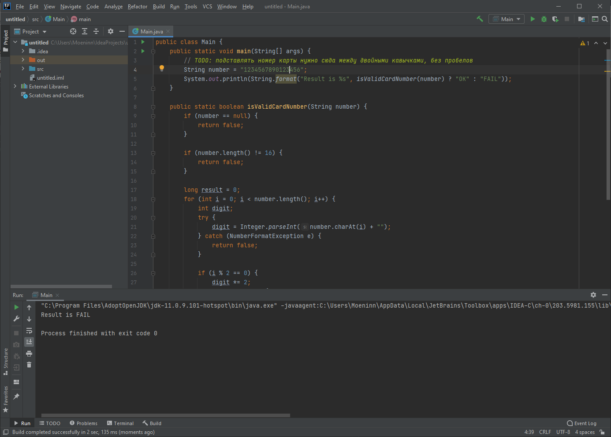
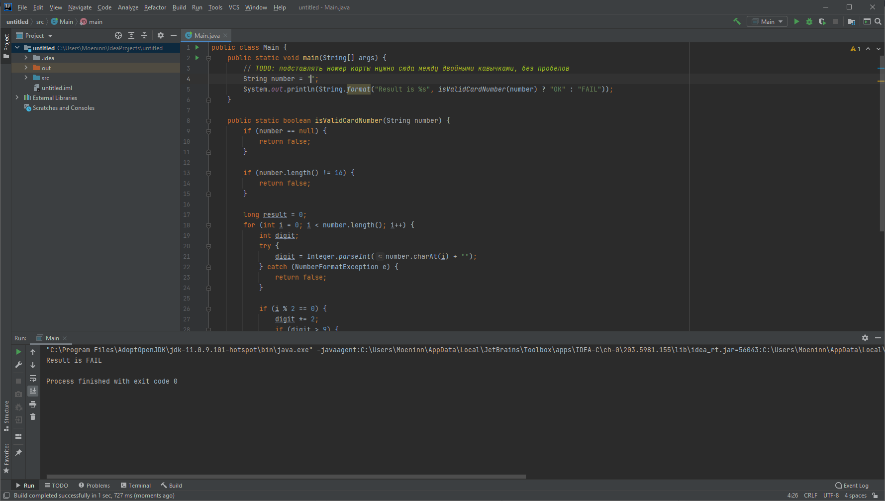

# Отчёт о тестировании Credit Card nmber Validator

## Краткое описание

15.12.2020 - 16.12.2020 было проведено исследовательское тестировани приложения Credit Card Number Validator.

На тестирование затрачено: 3ч

В результате тестирования выявлены следующие дефекты:
* [Карты платежной системы Amex валидируются как некорректные](https://github.com/Bogdmoen/jvqa1.2/issues/1)
* [Карты платежной системы Diner валидируются как некорректные](https://github.com/Bogdmoen/jvqa1.2/issues/2)
* [Карты платежной системы MIR валидируются как некорректные](https://github.com/Bogdmoen/jvqa1.2/issues/3)

## Описание процесса тестирования

В качестве тестовых данных использовались данные [портал для генерации номеров кредитных карт](https://creditcardgenerator.in):

- Тестирование осуществлялось путем запуска [кода](https://github.com/Bogdmoen/jvqa1.2/tree/master/code_card_validator/src) с подставлением значения кредитной карты  к параметру "string number"

- Код запускался в среде IntelliJ IDEA

- Если введенный номе карты корректный при запуске кода в консоли выводится сообщение - "RESULT IS OK". Если некорректный выводится сообщение "Result is FAIL"

- На невалидные номера выдается ответ _fail_

- На некорректные данные, такие как: спецсимволы, пустой инпут, кирилличесие\латинские символы - выдается ответ _fail_

- Протестированы карты различных платежных систем:
    - VISA - все карты провалидировались корректно
    - Mastercard -  все карты провалидировались корректно
    - Amex - все карты определяются как невалидные
    - Diner - все карты определяются как невалидные
    - MIR - все карты определяются как невалидные

Тестирование производилось в следующем окружении:
* Win 10x64
* Java 11.0.9.1
