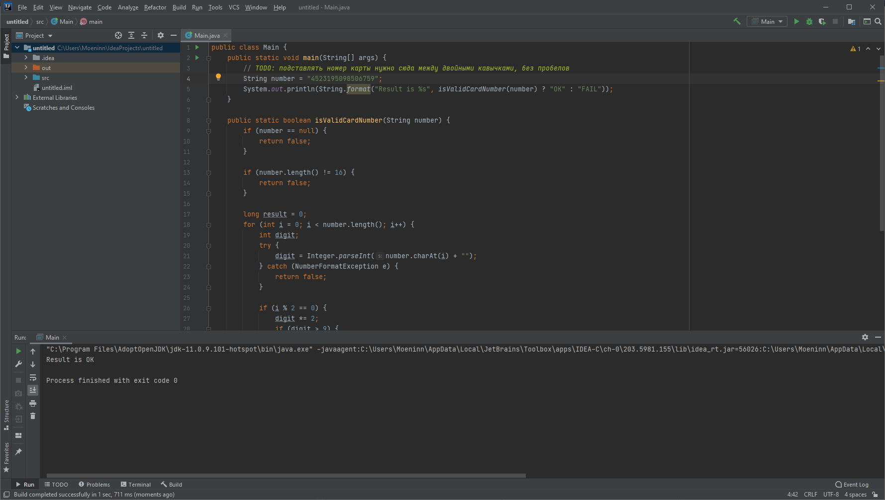

# Отчёт о тестировании Credit Card nmber Validator

## Описание процесса тестирования

- Код запускался в среде IntelliJ IDEA

- Для валидных номеров карт выдается корректный ответ _OK_

- На невалидные номера, а так де номера больше или меньше 16 символов выдается ответ _fail_

- На некорректные данные, такие как: спецсимволы, пустой инпут, кирилличесие\латинские символы - выдается ответ _fail_

- Во время тестирования дефектов не обнаружено

Тестирование производилось в следующем окружении:
* Win 10x64
* Java 11.0.9.1
